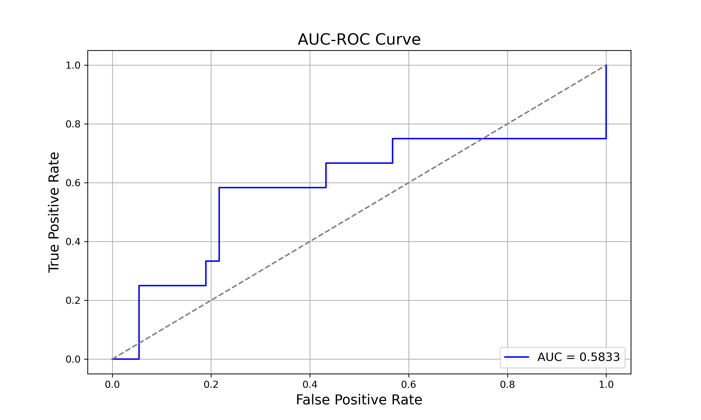
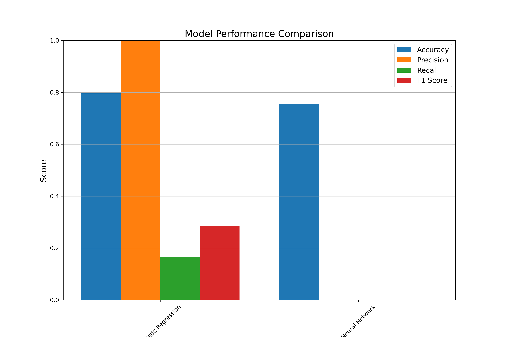
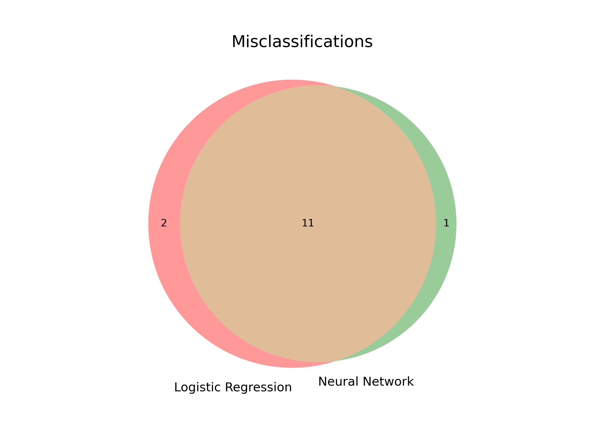
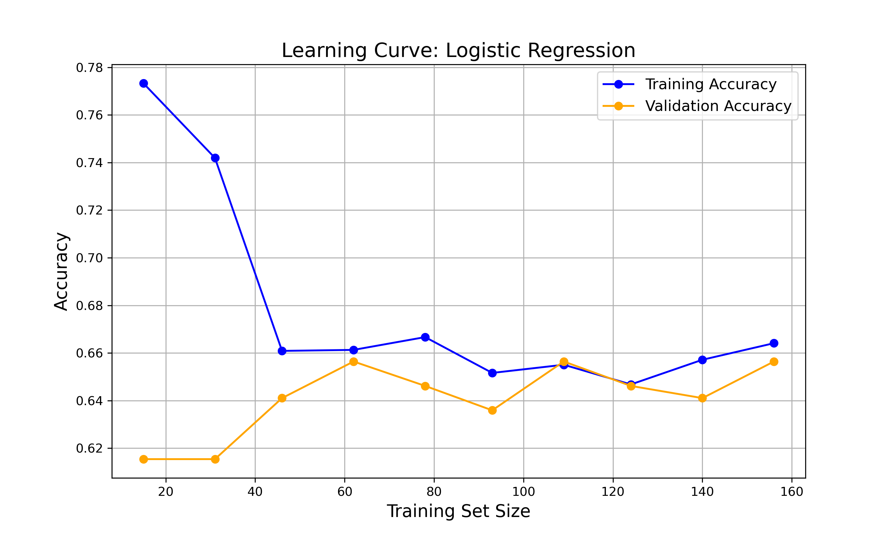

# CAN WE USE MACHINE LEARNING TO PREDICT IF YOU CAN COMPLETE A 24-HOUR FAST?
The objective was to determine whether machine learning could predict the success of a 24-hour fast. The data was collected from 13 volunteers over 17 days, gathering a little under 500 data points. Participants logged their hunger level, craving level, and mood level before starting their fasts and after they broke their fast. I also engineered features, such as "Difficulty Score" and averages.

## Parameter Tuning
I used two models: Logistic Regression and Neural Network. The Logistic Regression model achieved an accuracy of 76%, while the Neural Network struggled with overfitting due to the amount of features in my data and amount of data points. The model struggled with a low AUC-ROC score of 0.5833.



Logistic Regression had an ok accuracy but struggled with precision (0.3333) and recall (0.0833). Showing that it had a hard time finding the true positives.

The Neural Network preformed worse because the data was simple and their were not enough relevant features.

There was a common thread between the misclassifications between the two models (e.g., Mood × Hunger, Cravings × Hunger) that could improve prediction accuracy if modeled explicitly.





## Performance and Error Analysis
There is a common thread in the 11 misclassification between the two models.There is possibly some other factors that were not in the data like if someone had a stressful day or a bad nights sleep the night before.

## Conclusion
Fasting is very personalized and even though I wasn’t able to find a model that perfectly predicted fasting success using that data I collected the project gave me insight on what can be possible with much more personal data like having a wearable that can track your hunger, mood and biometrics (Heart Rate Variability, Sleep etc.) that can give you real-time predictions of likelihood of fasting success.

## **Setup**

### Prerequisites
Ensure you have the following dependencies installed:
- Python 3.8+
- pandas
- numpy
- scikit-learn
- matplotlib
- seaborn
- scipy
- tqdm

Install the dependencies using:
```bash
pip install pandas numpy scikit-learn matplotlib seaborn scipy tqdm
```
### File Structure
The project files are organized as follows:

- data/
    - fastingdata.py
- visulizations/
    - 
- scripts/
    - check_data.py
    - feature_engineering.py
    - optimize_alpha.py
    - normalize_difficulty_score.py
    - analyze_fasting_data.py
    - split_data.py
    - testing_regularization_strengths.py
    - evaluate_test_data.py
    - learning_curve.py
    - logistic_regression.py
    - compare_neural.py

Follow the steps below in the given order to execute the scripts:

```bash
python scripts/check_data.py
```
```bash
python scripts/feature_engineering.py
```
```bash
python scripts/optimize_alpha.py
```
```bash
python scripts/normalize_difficulty_score.py
```
```bash
python scripts/analyze_fasting_data.py
```
```bash
python scripts/split_data.py
```
```bash
python scripts/testing_regularization_strengths.py
```
```bash
python scripts/analyze_fasting_data.py
```
```bash
python scripts/evaluate_test_data.py
```
```bash
python scripts/learning_curve.py
```
```bash
python scripts/logistic_regression.py
```
```bash
python scripts/compare_neural.py
```
